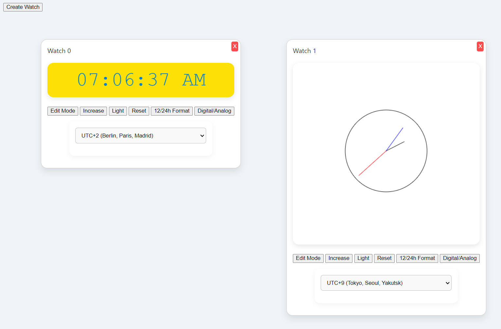

# Model-View-Controller Watch Learning Project



This project demonstrates the Model-View-Controller (MVC) pattern through a dynamic, interactive watch application. It allows users to add, edit, drag, and switch between digital and analog watches.


## User Manual

- **Edit Button**:

  - Press once: The hours will blink every second, indicating that the hours are now editable.

  - Press twice: The blinking shifts to the minutes, and they become editable, while the hours stop blinking.

  - Press three times: Editing stops; neither hours nor minutes blink.
  
- **Increase Button**: Increments either the hours or minutes, depending on the current mode (hours or minutes).

- **Reset Button**: Reverts any time changes and restores the watch to the current time of the selected timezone.

- **Analog Watch**: The interface can be switched to display an analog watch.
  - In analog mode, the minute handle can be dragged to set the time.

- **Draggable Watches**:

  - Watches can be added, dragged, or removed.

  - If you drag one watch on top of another, they will swap positions.


## Architecture

You can find the original specifications and UML class diagram below:
- [Specification](doc/instructions.md)
- [UML Diagram](doc/uml_part_c.md)


## Running the Application

To install and run the project:

```javascript
npm install
npm run start
```
Open the app in a browser at: http://localhost:1234/

To run the unit tests:
```javascript
npm test
```
