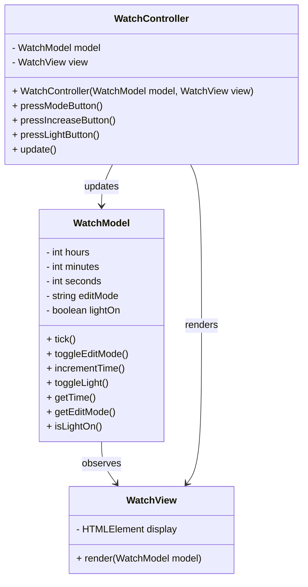

# Part A: Model-View-Controller architecture of a watch

This is a simple TypeScript implementation of watch application using the Model-View-Controller (MVC) design pattern.
This implementation is structured into the following components:

- `WatchModel` holds and manipulates the state of the watch by handling the timekeeping, edit modes, and background color.

- `WatchView` manages the UI, displaying the current state of the model. It renders the current state of the watch, taking into account the editable sections and background color.

- `WatchController` coordinates user input, updating the model and refreshing the view accordingly.

