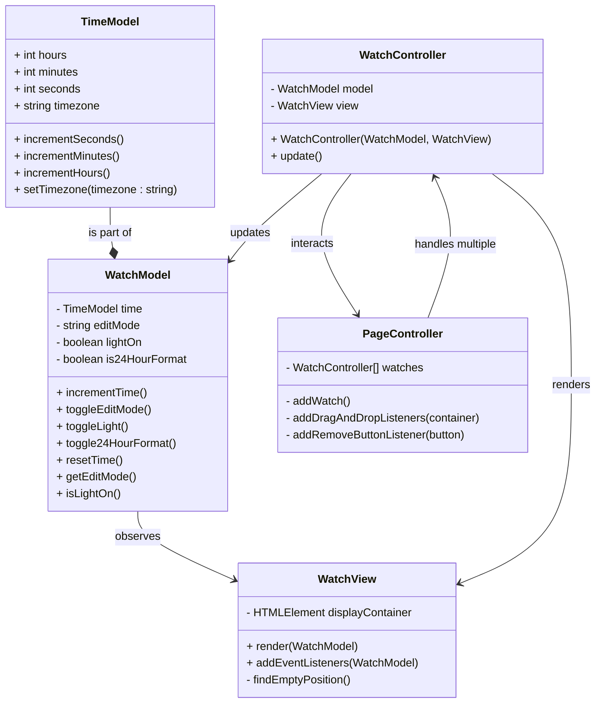

# Part B: MVC Implementation of Draggable Watches

This UML represents a Model-View-Controller (MVC) implementation of a system with multiple draggable watches.

- `WatchModel` holds and manipulates the state of the watch by handling the timekeeping, edit modes, and background color.
- `WatchView` manages the UI, displaying the current state of the model. It renders the current state of the watch, taking into account the editable sections and background color.
- `WatchController` coordinates user input, updating the model and refreshing the view accordingly.

In part B we add `PageController` class, which is responsible for:

- Handling user interactions, such as watch dragging, dropping, and swapping.
- Managing watch placements and ensuring the correct swap logic for watches in different positions.
- Adding new clocks to the system.
- Synchronizing all clocks to maintain consistent time across the interface.

The `PageController` serves as the intermediary in the MVC architecture, facilitating interactions between models (watch data) and views (the user interface). This design allows for modularity.

