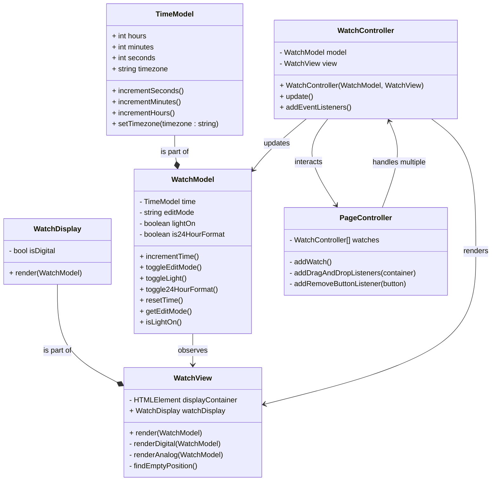

# Part C: Analog Watch User Interface Integration

This UML represents a Model-View-Controller (MVC) implementation of a system with multiple draggable watches.

- `WatchModel` holds and manipulates the state of the watch by handling the timekeeping, edit modes, and background color.
- `WatchView` manages the UI, displaying the current state of the model. It renders the current state of the watch, taking into account the editable sections and background color.
- `WatchController` coordinates user input, updating the model and refreshing the view accordingly.

In Part C, an analog watch user interface was integrated into an existing architecture. Key elements of the design include:

- A `Geometry` class is included to handle basic linear algebra operations that support UI positioning and drawing.
- A new `WatchDisplay` class, which allows for displaying time either as an analog clock or a digital clock.
- Buttons defined in the `WatchView` are shared across both user interface options (analog and digital).
This approach keeps the design consistent and simple.
- `TimeModel`, `WatchModel`, and `Geometry` classes are designed to be easily unit-testable without the need for mocks.

